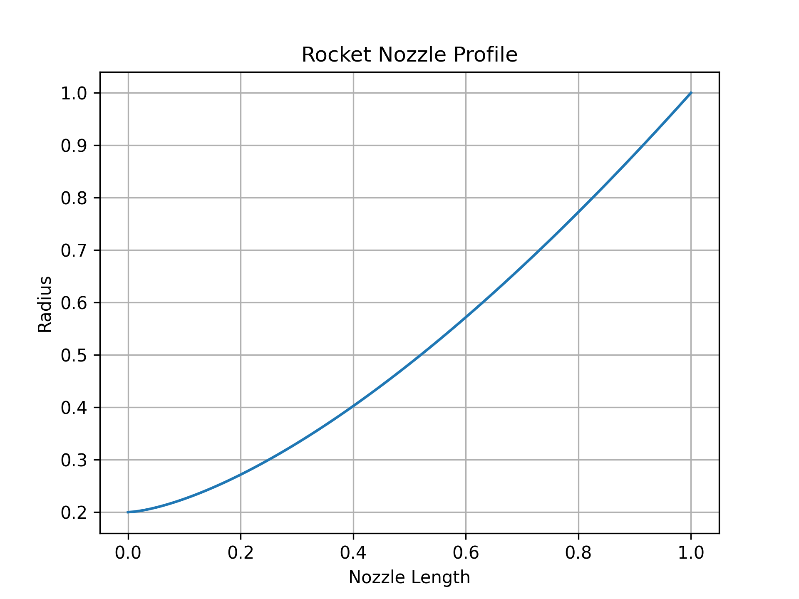
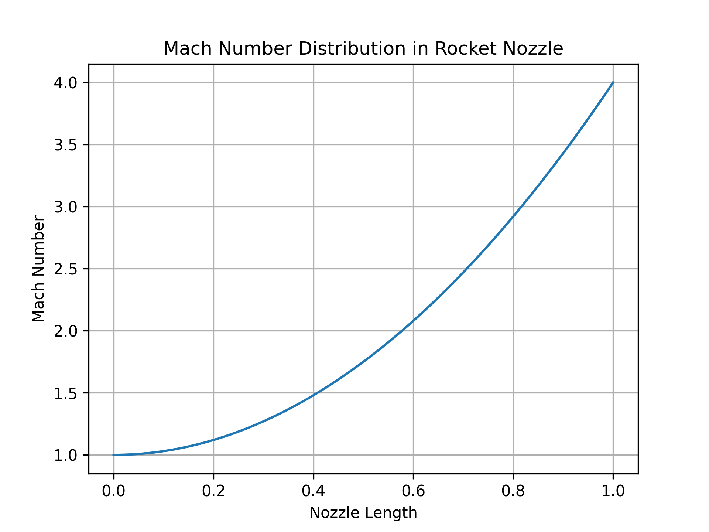

# Rocket Nozzle Profile (AutoCAD)

This project demonstrates the creation of a rocket nozzle contour using coordinate-based geometry in AutoCAD.

## Tools Used
- AutoCAD
- Microsoft Excel

## Method
1. Nozzle coordinate data generated and stored in CSV format.
2. Coordinates imported into AutoCAD using polyline commands.
3. Generated a smooth bell nozzle contour.

## Files
- nozzle_coords.csv → coordinate data
- nexnoz_profile.dwg → AutoCAD drawing
- nozzle_profile.png → final nozzle geometry

## Preview

## Application
This geometry represents a rocket propulsion nozzle profile used for expanding exhaust gases and generating thrust.
## Python Nozzle Profile Generator

The nozzle profile can also be generated using Python.

## Rocket Propulsion Theory

A rocket nozzle accelerates exhaust gases to supersonic speeds using a converging–diverging geometry.

### Key Concepts
- Converging section accelerates flow to Mach 1
- Throat is the minimum area
- Diverging section expands gases to supersonic speeds

### Governing Equation

Thrust equation:

F = m_dot * Ve + (Pe - Pa) * Ae

Where:
m_dot = mass flow rate  
Ve = exit velocity  
Pe = exit pressure  
Pa = ambient pressure  
Ae = exit area
## Mach Number Distribution

